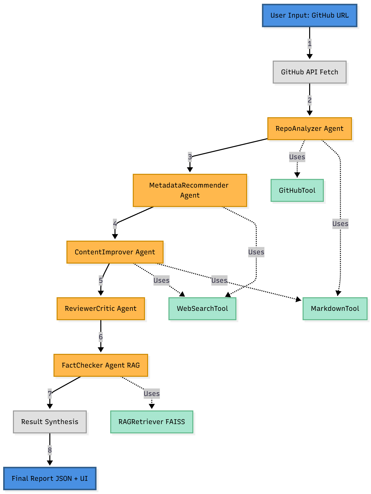

# 🩺 DrRepo

**Your Repository's Health Specialist**

Multi-agent AI platform that analyzes GitHub repositories and provides actionable recommendations to improve documentation quality, metadata, and discoverability.

[](https://www.python.org/downloads/)
[](LICENSE)
[](https://github.com/psf/black)
[](CONTRIBUTING.md)

---

## 📊 What is DrRepo?

DrRepo uses **5 specialized AI agents** powered by LangGraph to comprehensively analyze your GitHub repository and provide professional recommendations:

- 🔍 **Repository Analysis** - Metadata, structure, and organization
- 🏷️ **Metadata Optimization** - Discoverability and SEO
- ✍️ **Content Enhancement** - README quality and completeness
- ✅ **Quality Assessment** - Professional standards review
- 🔎 **Fact Checking** - Claims verification with RAG

---

## ✨ Features

- **Multi-Agent System**: 5 specialized AI agents working together
- **LangGraph Orchestration**: Sophisticated workflow management
- **RAG-Enhanced**: FAISS vector search for fact-checking
- **Free LLM**: Uses Groq (llama-3.3-70b) - no OpenAI needed
- **Quality Scoring**: 0-100 score with detailed breakdown
- **Priority Actions**: Ranked recommendations by impact
- **Web Interface**: Beautiful Streamlit UI
- **CLI Support**: Command-line interface for automation
- **JSON Export**: Complete analysis reports

---

## 🚀 Quick Start

### Prerequisites

- Python 3.9 or higher
- pip package manager
- Git

### Installation

Clone repository
```
git clone https://github.com/ak-rahul/DrRepo.git
cd DrRepo
```

Create virtual environment
```
python -m venv venv
```

Activate virtual environment
Windows:
```
venv\Scripts\activate
```

Linux/Mac:
```
source venv/bin/activate
```

Install dependencies
```
pip install -r requirements.txt
```


### Configuration

Create a `.env` file in the project root:

```
Groq API (Free - get from https://console.groq.com)
GROQ_API_KEY=your_groq_api_key_here

GitHub Token (get from https://github.com/settings/tokens)
GH_TOKEN=your_github_token_here

Tavily Search API (get from https://app.tavily.com)
TAVILY_API_KEY=your_tavily_api_key_here
```

### Run Web Interface
```
streamlit run app.py
```


Open your browser at `http://localhost:8501`

### Run CLI

```
python -m src.main https://github.com/psf/requests "Python HTTP library"
```

---

## 📖 Usage

### Web Interface (Recommended)

1. Start the Streamlit app: `streamlit run app.py`
2. Enter a GitHub repository URL
3. (Optional) Add a description for better context
4. Click "Analyze Repository"
5. View comprehensive results and download JSON report

### Python API
```
from src.main import PublicationAssistant
```

Initialize
```
assistant = PublicationAssistant()
```

Analyze repository
```
result = assistant.analyze(
    repo_url="https://github.com/fastapi/fastapi",
    description="Modern Python web framework"
)    
```

Access results
```
print(f"Quality Score: {result['repository']['current_score']:.1f}/100")
print(f"Status: {result}")
```

Print top recommendations
```
for item in result['action_items'][:3]:
    print(item)
```


### Command Line

Basic usage
```
python -m src.main <repo_url>
```

With description
```
python -m src.main <repo_url> "<description>"
```

Example
```
python -m src.main https://github.com/django/django "Python web framework"
```
---

## 🏥 Health Monitoring

DrRepo includes built-in health monitoring for production deployments.

### Streamlit UI Health Check

The Streamlit interface includes a **System Health** panel in the sidebar that shows:
- ✅ LLM API status (Groq/OpenAI)
- ✅ GitHub API status with rate limit info
- ✅ Tavily Search API status
- ✅ RAG retriever (FAISS) status
- ✅ Response latency for each component

Click the **🔄 Refresh Health Status** button to update.

### Production Health Check API

For production monitoring, DrRepo provides a FastAPI health check endpoint:

**Start the health API server:**
```
python scripts/run_health_api.py
```

**Health Check Endpoints:**

| Endpoint | Purpose | Response Time |
|----------|---------|---------------|
| `GET /health` | Comprehensive health check with all component details | ~2-5s |
| `GET /health/simple` | Quick health status (no component checks) | <100ms |
| `GET /health/components` | Individual component status only | ~2-5s |
| `GET /health/ready` | Kubernetes readiness probe | <100ms |
| `GET /health/live` | Kubernetes liveness probe | <50ms |

**Example Response (`/health`):**
```
{
"status": "healthy",
"timestamp": "2025-12-19T08:00:00Z",
"version": "1.0.0",
"provider": "groq",
"components": {
"llm_groq": {
"status": "up",
"latency_ms": 120,
"model": "llama-3.3-70b-versatile"
},
"github_api": {
"status": "up",
"latency_ms": 85,
"rate_limit_remaining": 4500,
"rate_limit_total": 5000
},
"tavily_api": {
"status": "up",
"latency_ms": 200
},
"rag_retriever": {
"status": "up",
"latency_ms": 45,
"embeddings_model": "sentence-transformers/all-MiniLM-L6-v2"
}
}
}
```
**HTTP Status Codes:**
- `200 OK`: All systems healthy
- `503 Service Unavailable`: One or more components degraded/down

---

## 🏗️ Architecture




### Key Components

- **LangGraph**: Multi-agent workflow orchestration
- **Groq**: Fast, free LLM inference (llama-3.3-70b)
- **FAISS**: Vector search for fact-checking
- **HuggingFace**: Embeddings for RAG
- **PyGithub**: GitHub API integration
- **Tavily**: Web search for best practices
- **Streamlit**: Web interface

---

## 🤖 Agent Specializations

Each of the 5 AI agents has a **distinct, non-overlapping role**:

| Agent | Unique Responsibility | What Sets It Apart |
|-------|----------------------|-------------------|
| **🔍 RepoAnalyzer** | Extract repository facts & metadata | Only agent with direct GitHub API access; provides data foundation for all others |
| **🏷️ MetadataRecommender** | Optimize discoverability & SEO | Only agent that researches competitor repositories for benchmarking |
| **✍️ ContentImprover** | Enhance README structure & content | Only agent that retrieves external best practices documentation |
| **✅ ReviewerCritic** | Audit quality with structured scoring | Only agent that provides 4-dimension scoring (Completeness, Clarity, Professionalism, Discoverability) |
| **🔎 FactChecker** | Verify claims with evidence | Only agent using RAG/FAISS vector search to validate README statements |

**Key Distinction:** Each agent uses different **tools** and **temperature settings** optimized for its specific task, ensuring specialized expertise rather than redundant analysis.

---

## 🎯 What Does It Analyze?

### Repository Metadata
- Stars, forks, watchers
- Language and topics
- License information
- Last updated date

### README Quality
- Content completeness (0-100 score)
- Structure and organization
- Code examples count
- Visual elements (images, badges)
- Missing sections identification

### Project Structure
- Test presence
- CI/CD configuration
- Contributing guidelines

### Content Quality
- Clarity and readability
- Professional standards
- Best practices compliance
- Claim verification (with RAG)

---

## 📊 Quality Score Breakdown

| Score | Status | Meaning |
|-------|--------|---------|
| 80-100 | Excellent | Professional, complete documentation |
| 60-79 | Good | Solid documentation, minor improvements needed |
| 40-59 | Needs Improvement | Significant gaps, needs work |
| 0-39 | Poor | Critical issues, major overhaul needed |

**Scoring Factors:**
- Word count (20 points)
- Section structure (20 points)
- Code examples (15 points)
- Visual elements (10 points)
- Extras (badges, TOC, links): +20 points
- Missing critical sections: -30 points

---

## 🛠️ Technology Stack

| Category | Technology |
|----------|-----------|
| **Orchestration** | LangGraph 0.2.28+ |
| **LLM** | Groq (llama-3.3-70b-versatile) |
| **Framework** | LangChain 0.3.0+ |
| **Vector DB** | FAISS (CPU) |
| **Embeddings** | HuggingFace Sentence Transformers |
| **APIs** | PyGithub, Tavily Search |
| **Frontend** | Streamlit 1.31.0+ |
| **Testing** | pytest, pytest-cov |
| **CI/CD** | GitHub Actions |


---

## 🧪 Testing

Run all tests
```
pytest tests/ -v
```

Run with coverage
```
pytest tests/ -v --cov=src --cov-report=html
```

Run specific test file
```
pytest tests/test_agents/test_repo_analyzer.py -v
```

Run integration tests
```
pytest tests/ -v -m integration
```

---

## 🐳 Docker

Build image
```
docker build -t drrepo:latest .
```

Run container
```
docker run -p 8501:8501 --env-file .env drrepo:latest
```

Or use docker-compose
```
docker-compose up
```

---

## 🤝 Contributing

We welcome contributions! Please see our [Contributing Guidelines](CONTRIBUTING.md) for details.

**Ways to Contribute:**
- 🐛 Report bugs
- 💡 Suggest features
- 📝 Improve documentation
- 🔧 Submit pull requests
- ⭐ Star this repository

---

## 📝 License

This project is licensed under the MIT License - see the [LICENSE](LICENSE.md) file for details.

---

## 🙏 Acknowledgments

- **LangChain & LangGraph** for the amazing agent framework
- **Groq** for free, fast LLM inference
- **HuggingFace** for open-source embeddings
- **GitHub** for the comprehensive API
- **Streamlit** for the beautiful web framework

---

## 📞 Contact & Support

- **Issues**: [GitHub Issues](https://github.com/ak-rahul/DrRepo/issues)
- **Discussions**: [GitHub Discussions](https://github.com/ak-rahul/DrRepo/discussions)


---

## 📈 Roadmap

- [ ] Parallel agent execution for faster analysis
- [ ] Batch repository processing
- [ ] Persistent vector store
- [ ] API endpoint deployment
- [ ] Support for private repositories
- [ ] Custom agent configuration
- [ ] Multi-language README support
- [ ] Comparison mode for multiple repositories

---

<div align="center">

**Made with ❤️ by [AK Rahul](https://github.com/ak-rahul)**

**DrRepo** | Your Repository's Health Specialist 🩺

[⬆ Back to Top](#-drrepo)

</div>